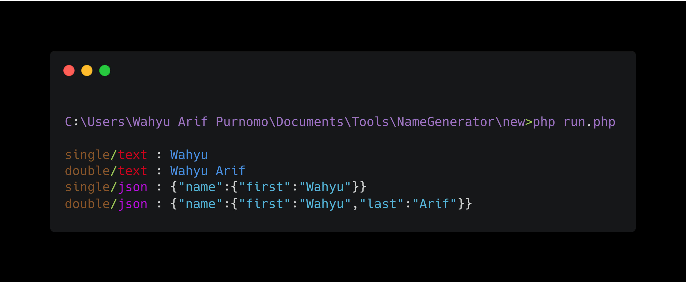

# Random-Name-Generator

Randomize names by library, single and double name and generate with text type and JSON
#

  

## Configuration Settings
You can configure settings in the config.php file, in the 'config / config.php' folder.
#
## Item your output, you can change to 'single' or 'double'.
Example output :
- single = 'Wahyu'
- double = 'Wahyu Arif'

Example source
- single : $item = 'single';
- double : $item = 'double';
#
## Type of output, you change to 'text' or 'json' type.
Example output :
- 'text' = 'Wahyu'.
- 'json' = '{"name":{"first":"Wahyu"}}'.

Example source :
- $type = 'text';
- $type = 'json';
#
## Random number to get name from index
#
## Usage

Enough to execute the command :

    php run.php

## Donation

    If you want to buy my coffee, you can send payments Paypal.

## Disclaimer

This is an open source for everyone, you may redistribute, modify, use patents and use privately without any obligation to redistribute. but it should be noted to include the source code of the library that was modified (not the source code of the entire program), include the license, include the original copyright of the author (warifp), and include any changes made (if modified). Users do not have the right to sue the creator when there is damage to the software or even demand if there is a problem caused by the makers of this tool. because every risk is caused by the user risk itself.
